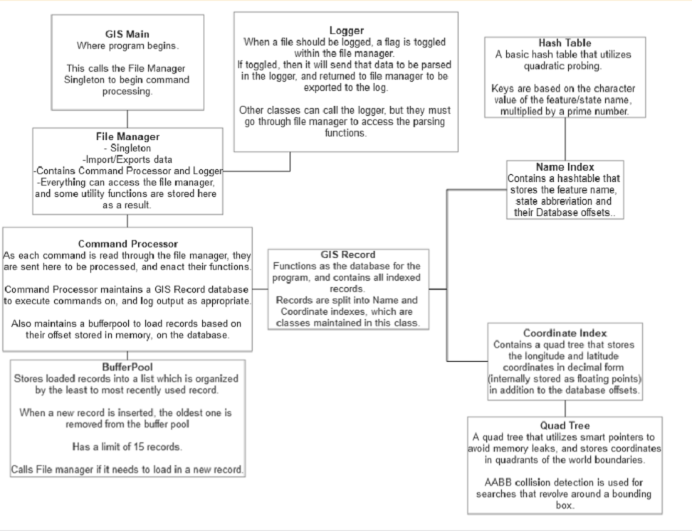

# GeographicInfoSystem
Algorithms Final Project

##Compilation Instructions
To compile, ensure you have “Make” installed, alongside C++ version 20 and g++
Open a terminal by the GIS.cpp file, and type “make run”.
The appropriate files will be compiled via g++ using C++ version 20. 
An executable called “GIS.exe” will be created. This can be invoked with the same terminal by calling 
“GIS.exe nameOfDatabaseFile.txt nameOfScriptFile.txt nameOfLogFile.txt”
Note that the first and last argument (for the database and log file respectively) are for files that will be created with the program. If they exist, they will be overwritten. 
The script file, argument #2, needs to exist next to the executable, or within a folder called “Data” next to the executable. The script file should follow the format provided in the initial ‘script01.txt’ file. 
When invoking the program, it will only run if the 3 arguments are provided. Otherwise, it will terminate. 

##Solution Description
This solution was primarily built and tested through Visual Studio Community 2022, and utilizes C++ 20. A simple Make file exists next to the project main file that builds the project via G++ (on C++ 20), which can be executed with “make run”. It will remove any instance of the compiled code, and recompile it to generate a new executable. 
The program assumes that you would have specified a database file name, a script file, and a log file name. If none of these parameters are provided, the program will not run.
Any database files used for importing records must be located either next to the program main file (GIS.cpp), or within a folder called “Data”, next to the main file. This was done for organizational purposes, so that the main folder would not be cluttered.
Upon execution of the solution, any commands with an incorrect number of arguments will be ignored and skipped during the parsing of a script file. 
Regex is heavily utilized to verify if certain commands are written correctly. While not every part of the code base uses regex, the initial parsing of script commands are verified using the data structure.
The project initializes the boundaries of the world using floating points that equate to the decimal version of the longitude and latitude coordinates, converted from the DMS format provided by a given command. 
Whenever a search is performed, the DMS coordinates provided will be converted into floating point DEC values for comparisons with the coordinate indexed records. Name indexed records are simply strings, and use string comparisons to return the correct records.
In regards to the world boundaries, this solution assumes that coordinates falling on the perimeter of the world boundaries are included within the world. That is to say, any coordinates within or equal to the world border are indexed and kept. 
The log file that is produced from the solution will display the decimal versions of longitude and latitude, stored in floating point values. Additionally, no debug statement will visually display the world generated and maintained by the program. Any offsets shown in the log file will also pertain to that records position in the Database file maintained by the program. However, internally the offset used to read/write records is different, so as to improve read/write times via C++ functions.
Lastly, records from the buffer pool are displayed from least used record to most used record. The reason for this is to prevent redundant reading from a list, as records are stored as a list within the buffer pool, and is being read using a for loop that allows access to each element from lowest to highest entry in the list.

##General Code Architecture 
The following diagram provides an overview of the relationship between classes:

As noted in the diagram, the FileManager is a singleton. As such, every class can access it. This is heavily utilized to access various data structures across the project, and execute utility functions such as conversions from DMS to DEC. 
The program, starting from GIS.cpp, will send the name of the script file to file manager in order to stream each command and process it as needed. File Manager calls command processor per command read, and command processor verifies if the command is valid via Regex. If it is, then it will be executed, and the following commands can be handled:
- World: Establish world boundaries by converting DMS to DEC, and storing that info in the GISRecord database (and subsequently, the Coordinate Index and quad tree). 
- Import: Each record in the provided file is read and compared against the world bounds established in GIS Record. If it is within or equal to the value of the bounding box for the world bounds, then the record will be send to GISRecord to be stored in both the quad tree and hash table. To do this, only specific parts of the record are kept, and the file offset (which is a value in bytes) and database line (the actual line on the database you can find a given record) are also stored (both of which are provided by the command processor).
- Debug: This calls any data structure the command processor can access to view its contents. This includes the bufferpool, quadtree and hash table (all of which have a ‘print’ function to view it’s contents). The string returned by each data structure is saved to the log file, accessed via file manager. 
- Quit: Sets a flag to prevent further processing of commands, in addition to calling the logger to submit an ‘end of file’ log. Once this flag is set, the program completes its execution and returns 0 at the end of GIS.cpp.
- What is at: Takes a pair of coordinates, and submits it to the coordinate index (and its quad tree). The class will return all the offsets that are found at that specific coordinate (which are compared as floating point values that were converted from DMS coordinates). If any are found, the bufferpool is called to obtain the records, and then they are formatted and logged. 
- What is: Takes a feature name and state abbreviation, and submits it to the name index (and its hash table). The class will return all the offsets that are found based on the key created from the feature/state name. If any are found, the bufferpool is called to obtain the records, and then they are formatted and logged.
- What is in: Takes a bounding box around a central point, and submits it to the coordinate index (and its quad tree). The class will return all the offsets that are found within that bounding box via AABB collision detection. The bounding box for the quad tree was established in the world command, where each necessary value used for the check is calculated.  If any are found, the bufferpool is called to obtain the records, and then they are formatted and logged.
